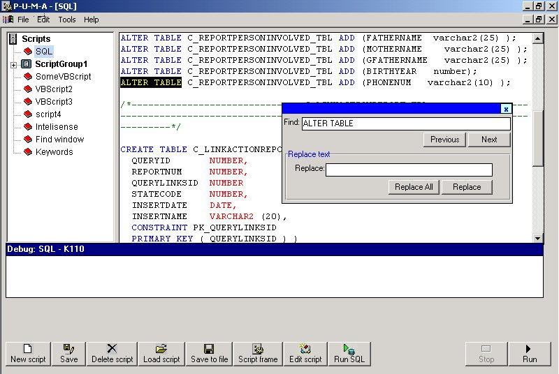



## Abware's PUMA \- General purpose advanced scripting editor

### Description

***UPDATE 07.09.2003***

fixed bug in loading script objects reference from the file scriptObjects.dat

***UPDATE 17.06.2003 

----

Fixed few bugs in the debugger mechanism, improved GUI, user control more generic and independent, Added new feature - LINKED DOCUMENTS: User can attach a script files to the tree view nodes and the application will synchronize the database to this files. Added vertical resize for the debug window.

----

GENERAL SCRIPTING EDITOR - This is a generic application to show, colorize, execute and even DEBUG !!! VB scripts and SQL scripts (DEBUG is only for vb scripts). You can write all kind of scripts and save them in the built in Knowledge base mechanism.

You can DEBUG Vb scripts by pressing F5 and then F8 to step row by row like in visual studio!!!

You can also Execute SQL scripts if u have ORACLE CLIENT installed. The editor contains VB like INTELISENSE mechanism to help u type your code. You can attach external objects to the editor simply by updating text files telling their names. these objects will show automatically in the intelisense mechanism. The editor is highly flexible and independent, you can plug it in any of your apps because its simply a user control (actualy 2 user controls and one class). The keywords coloring process depends on an internal database so you can update it to have your own keywords colored. the source code has lots of remarks but don't try to understand all of it - its to hard even for me (especialy the debugger mechanism and the RTF coloring). I also embedded some built in objects to help you type powerfull scripts and understand how this concept works the objects are:1) xml - for managing xml buffers 2) reg - to get registry values 3) seq - to do some nice tricks with the editor like running scripts from another another scripts and 4) system - for doing general stuff like writing to the debug window, sleep, doevents etc.

I use this scripting debugger every day especialy to run ORACLE SQLs and for storing my private knowledge base. Its a great all purpose tool that can expand to do anything you can imagine - simply add an external object to the editor and you have all its functionality ready to be excuted from your scripts.

Enjoy !

ADI BARDA ISRAEL
 
### More Info
 

             |
---                |---
**Submitted On**   |2003-06-17 14:52:26
**By**             |[ADI BARDA](https://github.com/Planet-Source-Code/PSCIndex/blob/master/ByAuthor/adi-barda.md)
**Level**          |Advanced
**User Rating**    |4.8 (24 globes from 5 users)
**Compatibility**  |VB 6\.0
**Category**       |[Complete Applications](https://github.com/Planet-Source-Code/PSCIndex/blob/master/ByCategory/complete-applications__1-27.md)
**World**          |[Visual Basic](https://github.com/Planet-Source-Code/PSCIndex/blob/master/ByWorld/visual-basic.md)
**Archive File**   |[Abware's\_P164242972003\.zip](https://github.com/Planet-Source-Code/adi-barda-abware-s-puma-general-purpose-advanced-scripting-editor__1-46115/archive/master.zip)

